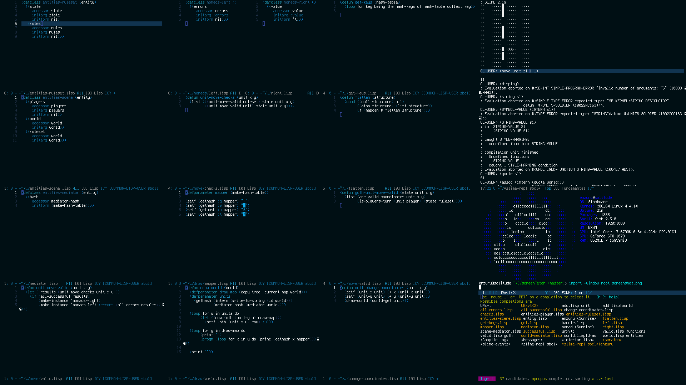

# enzu.ru .emacs.d

This `.emacs.d` documents a maximalist Emacs configuration utilizing most (but not all) of the latest trends in the Emacs community, tailored of course to my personal taste and needs. This involves around 150 different packages.

This means spicy choices like:

- `eglot` over `lsp-mode`
- `vert&co` over `helm` and `ivy`
- `corfu` over `company`
- `elpaca` over `package.el` and `straight.el`
- `flymake` over `flycheck` (what a comeback!)
- `meow` over `evil`
- `lispy` over `paredit`
- `sly` over `slime`
- `prism` over `rainbow-delimiters` and `rainbow-blocks`
- `eat` over all the other terminal emulators
- `gptel` over the dozens of other LLM clients

When I was starting off with Emacs, other people's customizations were deeply helpful for me as a starting point; some of those customizations still find a home in my Emacs instance today. In the spirit of free software, I hope that I can pass on the good will.

Where possible, the documentation directly links to the Emacs Lisp files that implement the mode or feature. Click around.

Using [org-roam-ui](https://github.com/org-roam/org-roam-ui), you can [navigate a map visualizing](https://enzuru.github.io/lisp-user-space/) how my Lisp user space tools work together on the [GNU operating system](https://gnu.org).

## Requirements

This config makes extensive use of language servers and tree-sitter grammars. Most of my best supported languages will try to load a language server or tree-sitter grammar. If it fails to, it will warn you and give you a chance to install what is missing.

I usually only support one version of Emacs at a time. Currently I am supporting:

- Emacs 30

## Features

### Operating systems

The following operating systems are supported:

- [FreeBSD](./enzuru/operating-systems/enzuru-freebsd.el)
- [GNU/Linux](./enzuru/operating-systems/enzuru-linux.el)
- [macOS](./enzuru/operating-systems/enzuru-mac.el)
- [OpenBSD](./enzuru/operating-systems/enzuru-openbsd.el)
- [Windows](./enzuru/operating-systems/enzuru-windows.el)

### Development environments

This Emacs configuration reflects my [REPL](https://en.wikipedia.org/wiki/Read%E2%80%93eval%E2%80%93print_loop)-centered [exploratory programming style](https://en.wikipedia.org/wiki/Exploratory_programming).

One can debate about which languages Emacs is actually ideal for, but Emacs is certainly a best-in-class environment for Haskell, Elixir, Common Lisp, Scheme, and Clojure.

#### First class

The best supported developer environments are the Lisp languages. Since they have feature rich IDEs with powerful REPLs, they do not need Eglot.

| Language                                            | IDE                                             | REPL                                            | Eglot |
|-----------------------------------------------------|-------------------------------------------------|-------------------------------------------------|-------|
| [Clojure](./enzuru/modes/enzuru-clojure.el)         | [CIDER](https://github.com/clojure-emacs/cider) | [CIDER](https://github.com/clojure-emacs/cider) | N/A   |
| [Common Lisp](./enzuru/modes/enzuru-common-lisp.el) | [SLY](https://github.com/joaotavora/sly)        | [SLY](https://github.com/joaotavora/sly)        | N/A   |
| [Scheme](./enzuru/modes/enzuru-scheme.el)           | [Geiser](https://www.nongnu.org/geiser/)        | [Geiser](https://www.nongnu.org/geiser/)        | N/A   |

#### Second class

Nix comes with pre-packaged language servers for these languages.

| Language                                          | IDE                                                                  | REPL                                                                     | Eglot |
|---------------------------------------------------|----------------------------------------------------------------------|--------------------------------------------------------------------------|-------|
| [C](./enzuru/modes/enzuru-c.el)                   | `c-ts-mode`                                                          |                                                                          | Yes   |
| [C++](./enzuru/modes/enzuru-cpp.el)               | `c++-ts-mode`                                                        |                                                                          | Yes   |
| [Elixir](./enzuru/modes/enzuru-elixir.el)         | [Alchemist](https://github.com/tonini/alchemist.el)                  | [inf-elixir](https://github.com/J3RN/inf-elixir/)                        | Yes   |
| [Fish](./enzuru/modes/enzuru-fish.el)             | [fish-mode](https://github.com/wwwjfy/emacs-fish)                    | [fish-completion](https://github.com/lemonbreezes/emacs-fish-completion) | Yes   |
| [GDScript](./enzuru/modes/enzuru-gdscript.el)     | [gdscript-mode](https://github.com/godotengine/emacs-gdscript-mode/) |                                                                          | Yes   |
| [JavaScript](./enzuru/modes/enzuru-javascript.el) | [js2-mode](https://github.com/mooz/js2-mode)                         | [Indium](https://github.com/NicolasPetton/Indium/)                       | Yes   |
| [Go](./enzuru/modes/enzuru-go.el)                 | `go-ts-mode`                                                         | [go-playground](https://github.com/grafov/go-playground)                 | Yes   |
| [Haskell](./enzuru/modes/enzuru-haskell.el)       | [Intero](https://chrisdone.github.io/intero/)                        | [Dante](https://github.com/jyp/dante)                                    | Yes   |
| [Python](./enzuru/modes/enzuru-python.el)         | `python-ts-mode`                                                     | `run-python`                                                             | Yes   |
| [Ruby](./enzuru/modes/enzuru-ruby.el)             | `ruby-ts-mode`                                                       | [inf-ruby](https://github.com/nonsequitur/inf-ruby)                      | Yes   |
| [Rust](./enzuru/modes/enzuru-rust.el)             | [Racer](https://github.com/racer-rust/emacs-racer)                   | [rust-playground](https://github.com/grafov/rust-playground/)            | Yes   |
| [TypeScript](./enzuru/modes/enzuru-typescript.el) | [Tide](https://github.com/ananthakumaran/tide)                       | [Indium](https://github.com/NicolasPetton/Indium/)                       | Yes   |

#### Third class

Quite frankly, most of these languages are best used within their respective IDEs, or I rarely use them at all.

| Language                                            | IDE                                                                          | REPL                                           | Eglot |
|-----------------------------------------------------|------------------------------------------------------------------------------|------------------------------------------------|-------|
| [Groovy](./enzuru/modes/enzuru-groovy.el)           | [groovy-mode](https://github.com/Groovy-Emacs-Modes/groovy-emacs-modes/)     |                                                | No    |
| [Java](./enzuru/modes/enzuru-java.el)               | `java-ts-mode`                                                               |                                                | No    |
| [Kotlin](./enzuru/modes/enzuru-kotlin.el)           | [kotlin-mode](https://github.com/Emacs-Kotlin-Mode-Maintainers/kotlin-mode/) |                                                | No    |
| [Objective-C](./enzuru/modes/enzuru-objective-c.el) | `objc-mode`                                                                  |                                                | No    |
| [Swift](./enzuru/modes/enzuru-swift.el)             | [swift-mode](https://github.com/swift-emacs/swift-mode/)                     |                                                | No    |
| [SQL](./enzuru/modes/enzuru-sql.el)                 | [sql-mode](https://www.emacswiki.org/emacs/SqlMode)                          | [emacsql](https://github.com/magit/emacsql)    | No    |

### Tools

This configuration ships with a great many helpful tools:

| Feature                                                               | Tool                                                                                                                          |
|-----------------------------------------------------------------------|-------------------------------------------------------------------------------------------------------------------------------|
| [Benchmarker](./enzuru/features/enzuru-benchmarks.el)                 | [elisp-benchmarks](https://elpa.gnu.org/packages/elisp-benchmarks.html)                                                       |
| [Bug tracker](./enzuru/features/enzuru-bug-tracking.el)               | [debbugs](https://elpa.gnu.org/packages/debbugs.html)                                                                         |
| [Clipboard](./enzuru/features/enzuru-clipboard.el)                    | [Clipetty](https://github.com/spudlyo/clipetty)                                                                               |
| [Completion (regular buffer)](./enzuru/features/enzuru-completion.el) | [Corfu](https://github.com/minad/corfu)                                                                                       |
| [Completion (minibuffer)](./enzuru/features/enzuru-completion.el)     | [Vert&co](https://github.com/minad/vertico#complementary-packages)                                                            |
| [Dashboard](./enzuru/features/enzuru-dashboard.el)                    | [Dashboard](https://github.com/emacs-dashboard/emacs-dashboard)                                                               |
| [Digital garden](./enzuru/features/enzuru-digital-garden)             | [org-roam](https://www.orgroam.com/)                                                                                          |
| [Docker client](./enzuru/features/enzuru-docker.el)                   | [docker.el](https://github.com/Silex/docker.el)                                                                               |
| [Documentation searcher](./enzuru/features/enzuru-documentation.el)   | [devdocs](https://github.com/astoff/devdocs.el)                                                                               |
| [Evaluation overlay](./enzuru/features/enzuru-overlay.el)             | [eros](https://github.com/xiongtx/eros)                                                                                       |
| [Key binding display](./enzuru/features/enzuru-help.el)               | [which-key](https://elpa.gnu.org/packages/which-key.html)                                                                     |
| [Gemini browser](./enzuru/features/enzuru-gemini.el)                  | [Elpher](https://thelambdalab.xyz/elpher/)                                                                                    |
| [Go client](./enzuru/features/enzuru-gaming.el)                       | [gnugo.el](https://github.com/emacsmirror/gnugo/)                                                                             |
| [HTTP browser](./enzuru/features/enzuru-browser.el)                   | [EWW](https://www.gnu.org/software/emacs/manual/html_mono/eww.html)                                                           |
| [Hyperlinker](./enzuru/features/enzuru-hyperlinking.el)               | [Hyperbole](https://www.gnu.org/software/hyperbole/)                                                                          |
| [IRC client](./enzuru/features/enzuru-irc.el)                         | [ERC](https://www.gnu.org/software/emacs/erc.html)                                                                            |
| [Kubernetes client](./enzuru/features/enzuru-kubernetes.el)           | [kubernetes-el](https://github.com/kubernetes-el/kubernetes-el)                                                               |
| [LLM client](./enzuru/features/enzuru-large-language-models.el)       | [gptel](https://github.com/karthink/gptel), [claude-code.el](https://github.com/stevemolitor/claude-code.el)                  |
| [LSP client](./enzuru/features/enzuru-lsp.el)                         | [Eglot](https://github.com/joaotavora/eglot)                                                                                  |
| [Mail client](./enzuru/features/enzuru-mail.el)                       | [Gnus](https://www.gnu.org/software/emacs/manual/html_node/gnus/Don_0027t-Panic.html)                                         |
| [Mail indexer](./enzuru/features/enzuru-mail.el)                      | [Notmuch](https://notmuchmail.org/notmuch-emacs/)                                                                             |
| [Modal editor](./enzuru/features/enzuru-modal-editing.el)             | [Meow](https://github.com/meow-edit/meow), [Lispy](https://github.com/abo-abo/lispy)                                          |
| [Modeline](./enzuru/features/enzuru-modeline.el)                      | [Smart Mode Line](https://github.com/Malabarba/smart-mode-line)                                                               |
| [MUD client](./enzuru/features/enzuru-gaming.el)                      | [mu.el](https://github.com/enzuru/mu)                                                                                         |
| [Music player](./enzuru/features/enzuru-music.el)                     | [Emms](https://www.gnu.org/software/emms/)                                                                                    |
| [Music streamer](./enzuru/features/enzuru-music.el)                   | [pianobar.el](https://github.com/agrif/pianobar.el)                                                                           |
| [Organization](./enzuru/modes/enzuru-org.el)                          | [org-mode](https://orgmode.org)                                                                                               |
| [Package manager](./enzuru/preferences/enzuru-packages.el)            | [elpaca](https://github.com/progfolio/elpaca)                                                                                 |
| [REST client](./enzuru/features/enzuru-rest.el)                       | [restclient.el](https://github.com/pashky/restclient.el)                                                                      |
| [Shell](./enzuru/features/enzuru-terminal.el)                         | [Eshell](https://www.gnu.org/software/emacs/manual/html_mono/eshell.html)                                                     |
| [Syntax checker](./enzuru/features/enzuru-syntax-checking.el)         | [flymake](https://www.gnu.org/software/emacs/manual/html_mono/flymake.html), [flyover](https://github.com/konrad1977/flyover) |
| [Syntax highlighter](./enzuru/features/enzuru-syntax-highlighting.el) | [prism](https://github.com/alphapapa/prism.el)                                                                                |
| [Terminal](./enzuru/features/enzuru-terminal.el)                      | [Eat](https://codeberg.org/akib/emacs-eat/)                                                                                   |
| [Undo visualizer](./enzuru/features/enzuru-undo.el)                   | [undo-tree](https://elpa.gnu.org/packages/undo-tree.html)                                                                     |
| [Version control](./enzuru/features/enzuru-version-control.el)        | [Magit](https://magit.vc)                                                                                                     |
| [Wikipedia editor](./enzuru/features/enzuru-wiki.el)                  | [mediawiki.el](https://github.com/hexmode/mediawiki-el)                                                                       |
| [Window configuration](./enzuru/preferences/enzuru-frames.el)         | [winner-mode](https://www.gnu.org/software/emacs/manual/html_node/emacs/Window-Convenience.html)                              |
| [Window handling](./enzuru/features/enzuru-movement.el)               | [windmove](https://www.gnu.org/software/emacs/manual/html_node/emacs/Window-Convenience.html)                                 |
| [Workspace manager](./enzuru/features/enzuru-arrangements.el)         | [activities.el](https://github.com/alphapapa/activities.el)                                                                   |

### Themes

I have many beautiful theme families:

- [arjen-grey](https://github.com/credmp/arjen-grey-theme)
- [deep-thought](https://github.com/enzuru/emacs-deep-thought-theme)
- [dracula](https://github.com/dracula/emacs)
- [catppuccin](https://github.com/catppuccin/emacs)
- [exotica](https://github.com/zenobht/exotica-theme)
- [gotham](https://github.com/emacsmirror/gotham-theme)
- [molokai](https://github.com/alloy-d/color-theme-molokai)
- [omtose-phellack](https://github.com/franksn/omtose-phellack-theme)
- [purple-haze](https://github.com/enzuru/emacs-purple-haze-theme)
- [sanityinc-tomorrow](https://github.com/purcell/color-theme-sanityinc-tomorrow)
- [timu-caribbean](https://gitlab.com/aimebertrand/timu-caribbean-theme)
- [timu-macos](https://gitlab.com/aimebertrand/timu-macos-theme)
- [timu-rouge](https://gitlab.com/aimebertrand/timu-rouge-theme)
- [timu-spacegrey](https://gitlab.com/aimebertrand/timu-spacegrey-theme)
- [zenburn](https://github.com/bbatsov/zenburn-emacs)

## Languages

I currently provide spellchecking for:

- English
- Portuguese

These dictionaries are stored in the [dict](https://github.com/enzuru/.emacs.d/tree/master/dict) folder.

## Keystrokes

This is a modal editing setup that uses two different modal editors: Meow and Lispy. Lispy is only for Lisp languages.

I [maintain the default Emacs keybindings](https://www.gnu.org/software/emacs/refcards/pdf/refcard.pdf), so I will not document them here. Meow will help you discover keystrokes after you hit `SPC` in keypad mode.

### Normal editing

Run `meow-tutor` to learn Meow.

[Meow documentation](https://github.com/meow-edit/meow/blob/master/KEYBINDING_QWERTY.org)

### Lisp editing

Lispy editing is activated only in major modes for Lisp languages when around parens in Meow's insert mode.

- `e` evaluate s-expression
- `f` forward point through parens
- `b` undo
- `]` move point down
- `[` move point up
- `>` slurp up next s-expression
- `<` barf up s-expression
- `w` move s-expression up
- `s` move s-expression down
- `r` raise s-expression
- `C-1` view documentation
- `C-2` view caller arguments

[Lispy documentation](https://oremacs.com/lispy/)

### Movement between buffers

Movement between buffers is accomplished with windmove:

- `Shift-up`
- `Shift-left`
- `Shift-right`
- `Shift-down`

### Tab management

I have keystrokes setup to emulate tmux/screen using Emacs tabs.

- `C-z(one) c(reates)` a new workspace.
- `C-z(one) k(ills)` a current workspace.
- `C-z(one) n(ext)` workspace.
- `C-z(one) p(revious)` workspace.

### Custom keystrokes

These are custom keystrokes that I have setup.

When in Meow's insert mode, prepend with `C-c`. When in Meow's keypad mode, prepend with `SPC`.

- `a(g)` search git repo using ag or grep
- `b(uffer)` switch buffers with autocompletion
- `i(sp)` search through Lisp symbols (defaults to Emacs Lisp)
- `d(ocumentation)` brings up documentation for symbol under cursor
- `e(at)` brings up the Eat terminal
- `k(ill)` kill buffer unconditionally
- `l(ocate)` locate a file
- `o(mpile)` compiles the buffer in a language appropriate way
- `p(ush)` pushes the current git branch
- `r(eplace string)` replace all occurrences of a string after point
- `s(tatus)` shows the current git status
- `t(abs)` search through tabs
- `y(ank)` show list of yanked items
- `<left>` previous buffer
- `<right>` next buffer
- `<up>` beginning of buffer
- `<bottom>` bottom of buffer

## Learning

Everything is very organized in the `enzuru` folder by feature, mode, preference, setup, operating system, and theme. While this repo should work immediately for you on a `git pull`, it's obviously a very personalized setup and many things won't appeal to you. If I were you, I would first take a look at my `init.el` and then pick a topical elisp file from there.

Happy hacking!
