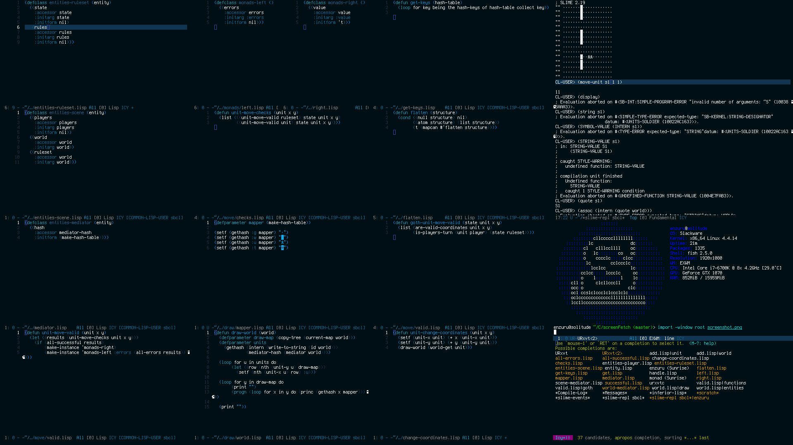

# enzu.ru .emacs.d



This is my `.emacs.d/` directory. When I was starting off with GNU Emacs, other people's customizations were deeply helpful for me as a starting point; some of those customizations still find a home in my Emacs instance today. In the spirit of free software, I hope that I can pass on the good will.

This repository includes submodules, so you will want to pull the code like this:

```
git clone --recurse-submodules -j8 https://github.com/enzuru/.emacs.d.git
```

Everything is very organized in the `enzuru` folder by feature, mode, preference, setup, operating system, and theme. While this repo should work immediately for you on a `git pull`, it's obviously a very personalized setup and many things won't appeal to you. If I were you, I would first take a look at my `init.el` and then pick a topical elisp file from there.

Happy hacking!
